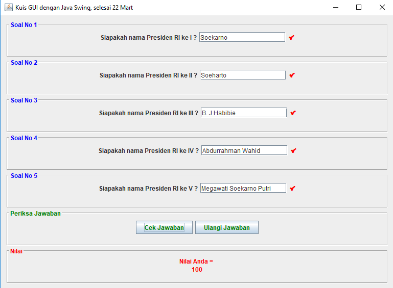
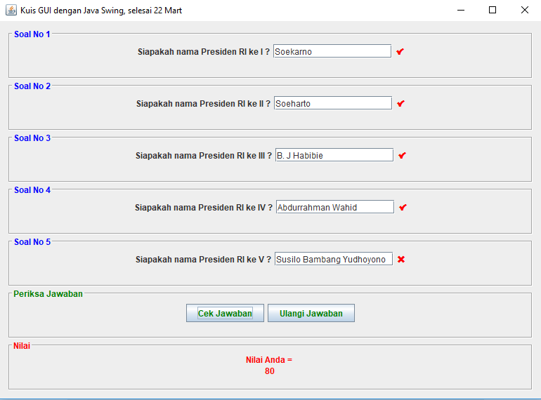

# SimpleJavaQuizGUI
Contoh Aplikasi Java Kuis Java dengan GUI

* Terima kasih untuk Mr. arcy di stackoverflow, untuk jawabannya yang ini : https://stackoverflow.com/a/23856409
* Terima kasih untuk [om Yohanes](https://www.facebook.com/yohanes) juga :)

**Sekilas cerita, kenapa saya buat program ini**

Saya sedang belajar membuat Aplikasi Kuis Android dengan JAVA, saya mendapatkan kendala di fungsi increment++ Java. Kendalanya adalah:   user bisa mendapatkan point (menyelesaikan kuis) hanya dengan mensubmit 1 jawaban yang benar secara berulang-ulang (semua ada 3 soal). Kemudian saya bertanya dengan [om Yohanes](https://www.facebook.com/yohanes). [om Yohanes](https://www.facebook.com/yohanes), menyarankan saya agar menggunakan Array. Jadi, jika jawaban betul array menyimpan nilai 1, kemudian dikalkulasi semua nilai arraynya.

Dari situ kemudian saya coba buat Aplikasi ini dengan basic Java, sekalian saya belajar basic Java juga.

**outputnya akan seperti ini, jika benar :**

**outputnya akan seperti ini, jika salah :**

**Noted**

Kenapa nama filenya PraktekinLagi.java?

Karena pada saat belajar membuat ini, saya mengulang sampai berkali-kali. Sampai saya bingung namain filenya apa lagi. Makanya saya namain PraktekinLagi.java saja :)
